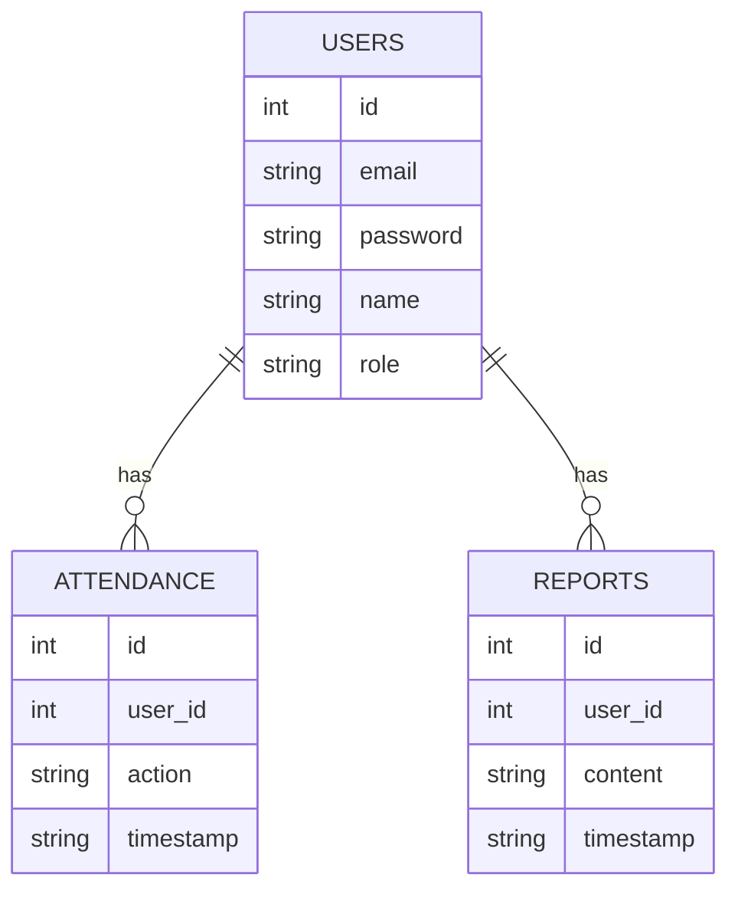
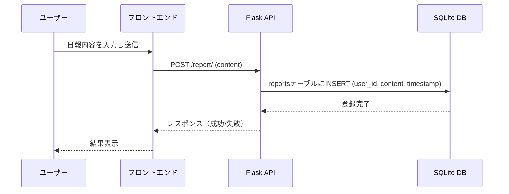

## 2025teachtraining02 README（開発・運用用）

このドキュメントは、attendance-app のローカル開発・Azure VM へのデプロイ・データベース構成・アーキテクチャ図を含む総合的な README です。

---

##  ローカルセットアップ手順（開発者向け）

1. リポジトリを clone

```bash
git clone https://github.com/your-org/attendance-app.git
cd attendance-app
```


2. Docker コンテナ起動

```bash
docker compose up -d --build
```

4. 動作確認

https://localhost/443

---

##  Azure VM へのデプロイ手順

### 方法①：手動デプロイ（SSH 経由）

1. Azure Portal で Ubuntu VM を作成し、ポート（22, 80, 443, 8080）を開放
2. SSH 接続して初期セットアップ：

```bash
ssh ubuntu@<VMのIP>
sudo apt update && sudo apt install docker.io docker-compose git -y
```

3. アプリを clone

```bash
cd ~
git clone https://github.com/your-org/attendance-app.git
cd attendance-app
```

4. .env を編集して設定を反映
5. コンテナ起動

```bash
docker-compose up -d --build
```

### 方法②：GitHub Actions による自動デプロイ（SSH）

1. ローカルで SSH キーを生成（例：github-actions-vm）

```bash
ssh-keygen -t rsa -b 4096 -C "github-deploy-key"
```

2. 公開鍵を Azure VM の \~/.ssh/authorized\_keys に追記

3. GitHub リポジトリに Secrets を登録：

* VM\_HOST: パブリックIP
* SSH\_PRIVATE\_KEY: 秘密鍵（BEGIN〜END 含む）

4. .github/workflows/deploy-vm.yml を作成：

```yaml
name: Deploy to Azure VM via SSH

on:
  push:
    branches: [main]

jobs:
  deploy:
    runs-on: ubuntu-latest
    steps:
      - name: SSH and Deploy
        uses: appleboy/ssh-action@v1.0.0
        with:
          host: ${{ secrets.VM_HOST }}
          username: ubuntu
          key: ${{ secrets.SSH_PRIVATE_KEY }}
          script: |
            cd ~/attendance-app
            git pull
            docker-compose down
            docker-compose up -d --build
```

---

##  DDL スクリプトの配置場所

このアプリ（app.py）では、init_db()関数内でPythonコードから直接テーブル作成（DDL）を実行しています。そのため、別途DDLスクリプト（schema.sqlなど）がありません。
SQLiteはファイル型DBで、アプリ起動時にテーブルがなければ自動で作成する設計が多く、今回の構成もそれに沿っています。

### 日報データの保存方式

- 日報本文をデータベースに保存しています。ファイルシステムに比べ、
検索や一括取得が容易なためです。大規模化した際にはストレージ分割も検討しますが、今回の用途では SQLite 一つで完結するシンプルさを優先しました。

### セキュリティ要件
このアプリ（app.py）はSQLiteを利用しており、DBはファイル（例: /db/app.db）としてローカルディスク上にのみ存在します。
SQLiteはネットワークポートを使わず、プロセスが直接ファイルを開いてアクセスします。
したがって、外部からDBポートでアクセスされることはありません。

---

##  アーキテクチャ図


* 内容：users, attendance\_logs, reports, roles などの関係

### シーケンス図


* 内容：ログイン処理（フロント → バック → Azure AD → トークン返却）

* 内容：ログイン処理（フロント → バック → Azure AD → トークン返却）
## テスト
 

- ユニットテスト
  FlaskのAPI（例：/register, /login）が意図通りに動作する
- 結合テスト
  ログインして日報を投稿できる流れが通ること
- 実行コマンド

```shell-session
#フロントエンドテストコマンド 
cd frontend 
pytest
```

```shell-session
#バックエンドテストコマンド
cd backend
npx jest 
```


---

この README はチーム開発・運用の共通手順書として活用してください。
